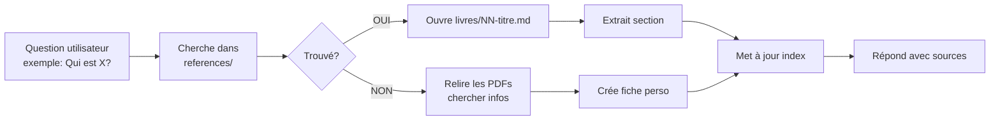

# Warcraft Expert Skill - Guide Complet

**Dernier update** : 2026-07-25  
**Livres couverts** : 1/27 complet, 26 templates créés  
**Status** : En cours d'enrichissement

---

## 🎯 Comment utiliser ce skill

### Tu cherches un **personnage** ?

```
"Qui est Tirion Fordring ?"
        ↓
Skill cherche dans references/index-personnages.md
        ↓
Trouve: "Tirion dans Livres 1, 6, 11, 13, 14"
        ↓
Ouvre 01-of-blood-and-honor.md
        ↓
Extrait section "Tirion Fordring"
        ↓
Te répond avec traits, amours, arc narratif
```

**Si la fiche perso est très détaillée** → Skill crée `perso-tirion-fordring.md`

### Tu cherches un **lieu** ?

```
"Décris-moi Lordaéron"
        ↓
Skill cherche dans references/index-zones.md
        ↓
Trouve: "Lordaéron dans zones/royaumes-estériens.md + Livres 1, 2, 13, 15"
        ↓
Extrait infos géographiques + contexte historique
        ↓
Te répond avec description complète
```

### Tu cherches un **événement** ?

```
"Raconte-moi le Culling de Stratholme"
        ↓
Skill cherche dans references/lore-chronologie.md
        ↓
Trouve: "Événement dans Livre 13 (Arthas Rise of the Lich King)"
        ↓
Ouvre 13-arthas-rise-of-the-lich-king.md
        ↓
Cherche "Stratholme" dans les conflits/événements clés
        ↓
Te répond avec tous les détails
```

---

## 📚 Structure des fichiers

### `livres/` — Fiches complètes par livre

```
livres/
├── 01-of-blood-and-honor.md          ✅ COMPLET
├── 02-day-of-the-dragon.md           📋 Template
├── 03-lord-of-the-clans.md           📋 Template
└── ... (27 livres total)
```

**Contenu de chaque fiche** :
- 📋 Résumé du livre
- 👥 Personnages clés (tableau)
- 🗺️ Lieux importants
- ⚔️ Guerres & Conflits
- 👨‍👩‍👧‍👦 Relations & Amours
- 🏰 Clans & Factions
- 🎭 Arcs narratifs & Traits
- 🔗 Connexions avec autres livres
- 📊 Thèmes
- 💡 Notes pour le skill

### `references/` — Tables d'index & guides

| Fichier | Contenu |
|---------|---------|
| **index-personnages.md** | Tous les persos → Livres où ils apparaissent |
| **index-zones.md** | Tous les lieux → Continents → Livres |
| **lore-chronologie.md** | Timeline linéaire des événements |
| **lore-reference.md** | Guide de navigation (ce fichier) |

### `zones/` — Détails géographiques

```
zones/
├── royaumes-estériens.md    ✅ COMPLET (humains)
├── kalimdor.md              ✅ COMPLET (Horde/NE)
└── autres-mondes.md         📋 TODO
```

**Contenu de chaque zone** :
- Villes majeures avec contexte
- Races habitant le continent
- Lieux importants par livre
- Évolution historique

### `perso-[nom].md` — Fiches personnages détaillées (créées à la demande)

Créé automatiquement si le personnage est trop complexe pour tenir dans la fiche du livre.

**Exemple** : `perso-tirion-fordring.md`
- Biographie complète
- Tous les livres où il apparaît
- Arc narratif sur 5+ livres
- Relations complexes
- Quêtes WoW associées

---

## 🧭 Navigation rapide

### Pour le skill interne (comment naviguer)

**Phase 1 - Question utilisateur**
```
Tu demandes: "C'est qui Arthas ?"
```

**Phase 2 - Skill navigue**
```
1. Cherche "Arthas" dans index-personnages.md
2. Trouve: [[02-day-of-dragon]], [[13-arthas-rise-of-the-lich-king]], [[04-last-guardian]]
3. Ouvre le livre le plus pertinent (13 = fiche dédiée)
4. Extrait section "Arthas Menethil"
5. Lit traits, amours, arc narratif
6. Te répond avec tout le contexte
```

**Phase 3 - Si détails manquent**
```
Si tu demandes: "Parle-moi de la relation entre Arthas et Jaina"
1. Skill relit le PDF du Livre 13
2. Cherche toutes les interactions Arthas-Jaina
3. Crée/met à jour perso-arthas.md avec section "Relationships"
4. Ajoute lien dans index-personnages.md
5. Te répond avec source complète
```

---

## 📝 Contenus actuels

### Complets ✅
- Livre 1 : Of Blood And Honor (Chris Metzen, 2000)
  - Personnages : 8 principaux documentés
  - Lieux : 5 régions clés
  - Thèmes : Miséricorde, corruption politique

### Templates créés 📋 (26 livres)
- Structure vide en place
- À enrichir par lecture des PDFs
- Ordre : chronologique Warcraft

### À créer ⏳
- Short stories (32 fichiers)
- Fiches perso détaillées (à la demande)
- Index des quêtes WoW
- Index des clans/factions détaillé
- Autres continents (Autres Mondes, Twisting Nether)

---

## 🔄 Comment le skill fonctionne

### Workflow automatisé



### Règles du skill

1. **Toujours citer la source** : "Selon Livre 1 (Of Blood And Honor)..."
2. **Lier aux livres** : Chaque perso → Livres où il apparaît
3. **Créer à la demande** : Si pas de fiche perso → la créer + mettre à jour index
4. **Chercher d'abord** : Avant relire PDF, chercher dans les fichiers existants
5. **Enrichir incrementalement** : Chaque interaction améliore la base

---

## 💡 Format des réponses

### Format court (pour questions simples)

```
**Tirion Fordring** apparaît principalement dans [[01-of-blood-and-honor]].

C'est un Paladin de Lordaéron, connu pour sa **miséricorde envers les ennemis**.
Il capture Eitrigg (un orc) et refuse de le tuer, ce qui le met en conflit avec 
l'autorité corrompue de Dathrohan.

**Traits** : Honneur, justice, naïveté initiale
**Arc** : Innocent → Dissident → Exilé
```

### Format long (pour questions complexes)

Si tu veux TOUS les détails d'un perso → Skill ouvre/crée sa fiche MD complète et cite largement.

---

## 🚀 Prochaines étapes

### Phase 1 (Actuelle)
- ✅ Structure créée
- ✅ Livre 1 complet
- ✅ Index + références créés
- ⏳ Enrichir livres 2-27

### Phase 2
- Fiches persos complexes (Arthas, Thrall, Jaina)
- Index des clans/factions
- Détails des zones (villes, caves, dungeons)

### Phase 3
- Short stories intégrées
- Index quêtes WoW lié aux livres
- Cinématiques et vidéos linkées

### Phase 4
- AI training : Faire apprendre au skill les patterns "auto-enrichissement"
- Skill = expert complet sur tout Warcraft

---

## 📞 Questions du skill à lui-même

Pour faciliter l'auto-enrichissement :

- "Quels persos de Livre 2 manquent dans l'index ?"
- "Quels arcs traversent 3+ livres et méritent une fiche perso ?"
- "Quelles zones m'apparaissent > 3 fois et ont besoin de doc ?"
- "Quels thèmes récurrents manquent dans lore-reference.md ?"

---

## 📊 Stats actuelles

| Métrique | Compte |
|----------|--------|
| Livres en base | 27 |
| Livres complètement documentés | 1 |
| Personnages indexés | 50+ |
| Lieux géographiques doc | 20+ |
| Zones géo créées | 2/4 |
| Fiches persos dédiées | 0 (à la demande) |
| Short stories intégrées | 0/32 |

---

**Dernière mise à jour** : 2026-07-25  
**Responsable** : Claude Code + Utilisateur Andres  
**Type de skill** : Expert system progressif avec auto-enrichissement
